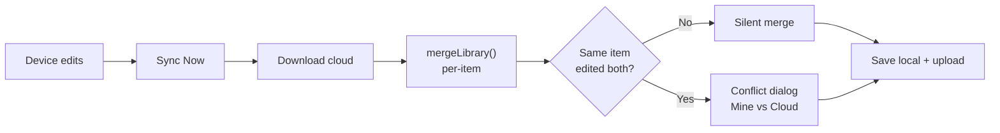

[README (10).md](https://github.com/user-attachments/files/30716198/README.10.md)
# 🌾 OπO Farming — Data Systems Pro

A mobile-first **Progressive Web App (PWA)** for farm field operations: live GPS
coverage mapping, equipment/field management, spray & seed calculators, season
reporting, and per-field **Profit & Loss** tracking — all with **Google Drive
cross-device sync** and full **offline** support.

Built to run on an in-cab tablet (Samsung Galaxy Tab) as part of the larger
**"Combine Brain"** retrofit project (RTK GPS guidance + machine telemetry on a
1979 Case IH 1480).

---

## 📖 Table of Contents
1. [Features](#-features)
2. [Tech Stack](#-tech-stack)
3. [File Structure](#-file-structure)
4. [Architecture](#-architecture)
5. [Data Model & Storage](#-data-model--storage)
6. [Cross-Device Sync](#-cross-device-sync)
7. [The Tabs](#-the-tabs)
8. [Profit & Loss Tab](#-profit--loss-tab)
9. [Releasing / Versioning](#-releasing--versioning-read-this-before-you-ship)
10. [Local Development](#-local-development)
11. [Troubleshooting](#-troubleshooting)
12. [Roadmap](#-roadmap)
13. [Changelog](#-changelog)

---

## ✨ Features

- **Live coverage mapping** — Google Maps overlay paints acres as you drive; boundary capture with offset (left/right/center of machine).
- **Field & Equipment library** — reusable fields (with boundaries) and machines (sprayer, combine, planter, tillage, spreader, swather, baler).
- **Tools / Calculators** — product/chemical mix calculator, cost-per-acre calculator.
- **Reports** — per-operation records (acres, bushels, gallons, bales, etc.).
- **Season dashboard** — totals grouped by crop / field / equipment / month, with CSV & PDF export.
- **Profit & Loss** — manual per-field/crop income & expense tracking, to the penny.
- **Google Drive sync** — per-item merge with conflict resolution and delete propagation.
- **Offline-first** — service worker caches the app shell; works with no signal.
- **Import / Export** — full JSON backup (optionally including note photos).
- **Light & dark themes** — via CSS variables.

---

## 🧱 Tech Stack

- **Vanilla JS / HTML / CSS** — no framework, no build step.
- **PWA** — `manifest.json` + `sw.js` service worker.
- **localStorage** — primary data store (keyed objects).
- **IndexedDB** — note photo blobs.
- **Google APIs** — Maps JavaScript API (mapping) + Google Identity Services / Drive (sync).

---

## 📂 File Structure

| File | Purpose |
|------|---------|
| `index.html` | App shell: markup for all tabs, inline styles, script includes |
| `app.js` | Core logic: tabs, mapping, sessions, sync engine, calculators, **P&L module** |
| `styles.css` | Global styles + theme variables (`--panel`, `--accent`, `--green`, …) |
| `config.js` | Google Maps API key + OAuth Client ID (NOT committed with real keys) |
| `uxenhancements.js` | UI niceties (card reordering, etc.) |
| `asapplied.js` | As-applied data handling |
| `sw.js` | Service worker: cache versioning + offline strategy |
| `manifest.json` | PWA metadata (icons, theme color, display mode) |
| `icon-*.png`, `favicon.ico` | App icons |

---

## 🏗️ Architecture

```
┌──────────────────────────────────────────────┐
│  index.html  (tabs + panels + inline styles)  │
└───────────────┬──────────────────────────────┘
                │ loads
     ┌──────────┼───────────┬──────────────┐
     ▼          ▼           ▼              ▼
  config.js  app.js   uxenhancements.js  asapplied.js
                │
     ┌──────────┼─────────────────────────────┐
     ▼          ▼             ▼                ▼
 localStorage IndexedDB  Google Maps   Google Drive (sync)
```

**Tab system** (simple + robust):
- Nav button: `<button class="tab" data-tab="X">Label</button>`
- Panel: `<section id="tab-X" class="tab-panel">…</section>`
- Switcher in `app.js` toggles `.active` and can run a render hook per tab
  (e.g. `renderSeason()` for Season, `window.plRender()` for Profit & Loss).

---

## 🗃️ Data Model & Storage

All primary data lives in `localStorage` as **keyed objects** (`{ id: {…item} }`),
each item carrying a `_modified` (or `savedAt`) ISO timestamp used for sync
conflict resolution.

| Data | localStorage key | Tombstone key | Timestamp field |
|------|------------------|---------------|-----------------|
| Fields | `dof_fields_library` | `dof_tomb_fields` | `_modified` |
| Equipment | `dof_equipment_library` | `dof_tomb_equipment` | `_modified` |
| Reports | `dof_reports` | `dof_tomb_reports` | `savedAt` |
| Seed presets | `dof_seed_presets` | `dof_tomb_seed` | `_modified` |
| **Profit & Loss** | `dof_pl_library` | `dof_tomb_pl` | `_modified` |
| Note photos | *(IndexedDB)* | — | — |

**Tombstones** record deletions (`{ id: deletedAtISO }`) so a delete on one
device propagates to others instead of the item reappearing. They auto-expire
after `TOMB_MAX_AGE_DAYS` (90).

---

## 🔄 Cross-Device Sync

Sync runs against a single JSON file in the user's Google Drive. Trigger points:
**sign-in** and the **"Sync Now"** button (not on every keystroke).

**Flow (`syncNow()`):**
1. Download the cloud copy from Drive.
2. `buildMerge(cloud)` → `mergeLibrary()` merges each collection item-by-item:
   - newest `_modified` wins on a straight update,
   - deletions win when a tombstone is newer than the item,
   - **same item edited on both devices → conflict** (user picks Mine vs Cloud).
3. Snapshot current data to a rollback key, save merged data locally.
4. Upload the merged payload back to Drive.
5. Refresh visible lists (fields, equipment, reports, seed presets, **P&L**).



The sync **payload** includes: `fields`, `equipment`, `reports`, `seedPresets`,
`profitLoss`, and `tombstones`.

---

## 🗂️ The Tabs

| Tab | ID | Render hook | What it does |
|-----|----|-----------|--------------|
| Operate | `tab-operate` | — | Live mapping / active session |
| Field & Equipment | `tab-setup` | — | Manage fields & machines |
| Tools | `tab-tools` | `seedMixCalcFromState()` etc. | Mix & cost calculators |
| Reports | `tab-reports` | — | Operation records |
| Season | `tab-season` | `renderSeason()` | Season totals + charts + export |
| **Profit & Loss** | `tab-pl` | `window.plRender()` | Per-field income/expense tracking |

---

## 💰 Profit & Loss Tab

Manual per-field/crop P&L, matching the app's look, theme, and sync behavior.

**Location:** self-contained module at the bottom of `app.js`
(`/* PROFIT & LOSS MODULE */`). Exposes `window.plRender()` for the tab switcher
and post-sync refresh.

**Behavior:**
- **KPI cards:** Total Income, Total Expenses, Net Farm Income (green/red), Total Acres.
- **Per field:** crop (with unit), acres, yield, price, other income, plus
  **Variable** and **Fixed** cost line items, with subtotals and a Net (P/L).
- **To the penny:** all money formats to 2 decimals; inputs accept cents (`step="0.01"`).
- **Live subtotals:** editing a value updates that card's subtotals **in place**
  (no full re-render → cursor stays put) plus the top KPI cards.
- **CSV export** and **Clear All**.

**Storage & sync:** stored as a keyed object under `dof_pl_library`, each field
with an `id` and `_modified` stamp. Syncs exactly like Fields/Equipment
(merge + conflict dialog + tombstones on delete/clear). A one-time migration
converts any legacy `opio_farmPL` array data to the new format.

**Crops (with units):** Alfalfa Hay (tons), Grass Hay (tons), Corn (bu),
Soybeans (bu), Wheat (bu), Oats (bu), Sorghum (bu), Other (units).

**Expense lines:**
- *Variable:* Seed, Fertilizer / Lime, Chemicals, Fuel & Oil, Repairs, Custom Hire, Hired Labor, Supplies, Hauling / Marketing
- *Fixed:* Land Rent, Water Rights, Equipment Depreciation, Property Taxes, Insurance, Interest, Dues & Fees

---

## 🚀 Releasing / Versioning (READ THIS BEFORE YOU SHIP)

Because this is a **cached PWA**, shipping code changes is only half the job —
you must **bust the cache** or devices keep running the old files. There are
**THREE things to bump** on every release, and they must all use the same build
number.

### The 3 bumps

1. **Cache version — `sw.js`**
   - `const CACHE_VERSION = "opio-YYYY.MM.DD-N";`
   - Every `?v=YYYYMMDD-N` in the `CORE_ASSETS` list.

2. **Asset query strings — `index.html`**
   - `styles.css?v=YYYYMMDD-N`
   - `config.js?v=…`, `app.js?v=…`, `uxenhancements.js?v=…`, `asapplied.js?v=…`

3. **User-visible version label**
   - `app.js`: `window.APP_VERSION = "YYYY.MM.DD · NN";`  ← the authoritative one
   - `index.html`: the `#appVersion` fallback span (keep it matching)

> ⚠️ **Keep `N` / `NN` consistent** across all three so the cache version, asset
> URLs, and the label all tell the same story. The `?v=` strings in `sw.js` must
> match those in `index.html` or precaching will fetch the wrong copies.

### Deploying to a device
After deploying the new files, the old service worker can cling on. Once per
release, on each device:
- **Fully close** the app (swipe away from recents), then reopen; **or**
- Browser → clear site data / reset, then reload; **or**
- If installed to the home screen: uninstall + re-add.

You'll know it worked when the header shows the new **vYYYY.MM.DD · NN**.

`v2026.08.02 · 14` (cache `opio-2026.08.02-14`)
`v2026.08.02 · 09` (cache `opio-2026.08.02-9`)

---

## 💻 Local Development

No build step — it's plain files. To run locally you need a static server
(service workers require http/https, not `file://`):

```bash
# any static server works, e.g.:
npx serve .
# or
python3 -m http.server 8080
```

Then open `http://localhost:8080`.

**Config:** put your Google Maps API key + OAuth Client ID in `config.js`.
Do **not** commit real keys.

**Editing tips:**
- The P&L module is self-contained at the end of `app.js` — safe to edit in isolation.
- New tabs = add a `data-tab` button + a `#tab-X` panel + (optional) a render hook in the tab switcher.
- Style with the existing CSS variables so light/dark themes both work.

---

## 🛠️ Troubleshooting

| Symptom | Likely cause | Fix |
|---------|-------------|-----|
| New feature/tab doesn't appear | Old cache still served | Do all **3 version bumps**, then fully reload / reinstall the PWA |
| "Add Field" / buttons do nothing | Running an old cached `app.js` | Same as above — cache bust |
| Version label shows an old date | `window.APP_VERSION` in `app.js` not bumped | Update it (and the `#appVersion` fallback) |
| P&L not syncing | Not signed in, or didn't tap Sync Now | Sign in to Google, then **Sync Now** on both devices |
| Same field differs across devices | Edited on both between syncs | Resolve via the **conflict dialog** (Mine vs Cloud) |
| Deleted item reappears after sync | Tombstone not recorded | Ensure deletes call `recordTombstone(LS_TOMB_*, id)` |
| Subtotals not updating live | Full re-render vs in-place update | P&L updates the edited card in place + KPIs; crop change does a full re-render |

---

## 🗺️ Roadmap

This app is **Phase 1's software layer** of the larger "Combine Brain" build.

- ✅ **RTK GPS** — centimeter guidance feeding the tablet (FRTK achieved).
- ✅ **Farming PWA** — mapping, reports, season, **P&L**, cross-device sync.
- ✅ **Rotor tach** — factory OEM rotor tach restored (no ESP32 needed — using the original sealed, calibrated gauge). *Was Phase 2; done the smart way.*
- ⏭️ **Phase 2:** Fuel level.
- ⏭️ **Phase 3:** Engine-bay temp + buzzer alarm.
- ⏭️ **Phase 4:** Permanent in-cab HMI dashboard tying it all together.

**Golden rules for old iron:** protect the 3.3V ESP32 from the 12V machine, use
clean buck-regulated power, seal against heat/vibration/dust, keep a solid common
ground, engine OFF near the rotor, and buy the HMI last.

---

## 📜 Changelog

Versions use the format `vYYYY.MM.DD · NN` (see [Releasing / Versioning](#-releasing--versioning-read-this-before-you-ship)).

| Version | Highlights |
|---------|-----------|
| **v2026.08.02 · 14** | Variable cost lines can now be entered **per-acre or as a total**, with a `Total $` ⇄ `$/ac` toggle on each line (per-acre mode shows a live "= $X total" hint). Resolved amounts flow into subtotals, per-acre KPIs, and CSV export; syncs via `expenseModes` and is backward-compatible with older saved fields. **Also repaired `index.html`**, which had accumulated duplicate/triplicate `<script>` tags (app.js loading at -14/-12/-10 at once), 4 stray duplicate subtitle lines, a missing `<body>` tag, and a missing title from earlier line-numbered edits (builds 10–13). Header + script blocks rebuilt against the clean structure. |
| **v2026.08.02 · 13** | Per-acre figures (Income/Acre, Expense/Acre, Net/Acre) now shown **under each field name** on its card — updating live and colored green/red — while the farm-wide per-acre total row remains at the top. |
| **v2026.08.02 · 12** | P&L CSV export now includes per-acre columns (Income/Acre, Expense/Acre, Net/Acre) on every field row, plus a farm-wide **TOTALS** row. |
| **v2026.08.02 · 11** | Added **per-acre KPI row** to the P&L tab (Income/Acre, Expenses/Acre, Net Income/Acre) below the existing totals; Net/Acre card colors green/red. Divide-by-zero safe. |
| **v2026.08.02 · 10** | **Stability fix:** repaired syntax errors introduced during the P&L sync work (stray/duplicated braces + duplicated function declarations) that were crashing all of `app.js`. Added acorn-parser validation to the release process. |
| **v2026.08.02 · 09** | **Profit & Loss now syncs across devices** — P&L stored as a keyed object (`dof_pl_library`) and wired into the Drive sync engine (merge + conflict dialog + tombstones), exactly like Fields/Equipment. One-time migration from legacy `opio_farmPL` array. Added P&L to backup/import/export summaries. Updated visible version label. |

*Older history predates this changelog. Going forward, add a row here on every release alongside the three version bumps.*

---

*OπO Farming — Data Systems Pro · built for the field, works offline, syncs when you're back in range.* 🚜
