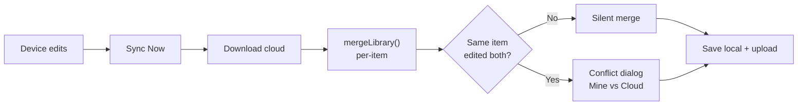

[README (18).md](https://github.com/user-attachments/files/33234318/README.18.md)
# 🌾 OπO Farming — Data Systems Pro

A mobile-first **Progressive Web App (PWA)** for farm field operations: live GPS
coverage mapping, equipment/field management, spray & seed calculators, season
reporting, per-field **Profit & Loss** tracking, **seed-tag OCR + lot
inventory**, an in-app **Field Guide handbook**, and a **DIY yield monitor**
that talks to an ESP32 over Web Serial — all with **Google Drive cross-device
sync** and full **offline** support.

Built to run on an in-cab tablet (Samsung Galaxy Tab) as part of the larger
**"Combine Brain"** retrofit project — RTK GPS guidance, machine telemetry,
and DIY optical yield monitoring on a 1979 Case IH 1480.

---

## 🔗 Related project

**[opio-yield-monitor](https://github.com/Otto-9092/opio-yield-monitor)** — DIY
optical yield monitor for the 1480's clean grain elevator (ESP32 + IR sensor
pair + RTK-GNSS, ~$100 in parts). The **Yield Monitor** tab in this app now
consumes the ESP32's live event stream over **Web Serial** for calibration
runs and stores per-crop locked K values. Live in-field yield mapping is the
next step once the sensor pair is bolted onto the elevator.

---

## 📖 Table of Contents
1. [Features](#-features)
2. [Tech Stack](#-tech-stack)
3. [File Structure](#-file-structure)
4. [Architecture](#-architecture)
5. [Data Model & Storage](#-data-model--storage)
6. [Cross-Device Sync](#-cross-device-sync)
7. [The Tabs](#-the-tabs)
8. [Coverage Painting & GPS Smoothing](#-coverage-painting--gps-smoothing)
9. [Profit & Loss Tab](#-profit--loss-tab)
10. [Seed Tag + Inventory](#-seed-tag--inventory)
11. [Yield Monitor Tab](#-yield-monitor-tab)
12. [Field Guide (Handbook)](#-field-guide-handbook)
13. [Releasing / Versioning](#-releasing--versioning-read-this-before-you-ship)
14. [Local Development](#-local-development)
15. [Troubleshooting](#-troubleshooting)
16. [Roadmap](#-roadmap)
17. [Changelog](#-changelog)

---

## ✨ Features

- **Live coverage mapping** — Google Maps overlay paints acres as you drive; boundary capture with offset (left/right/center of machine).
- **Swath smoothing (build-27)** — minimum-distance gate, EMA-smoothed heading, and GPS-dropout detection kill the zig-zag jitter when creeping or when a fix momentarily drifts.
- **Field & Equipment library** — reusable fields (with boundaries) and machines (sprayer, combine, planter, tillage, spreader, swather, baler).
- **Tools / Calculators** — product/chemical mix calculator, cost-per-acre calculator.
- **Reports** — per-operation records (acres, bushels, gallons, bales, etc.) with as-applied rate layers.
- **Season dashboard** — totals grouped by crop / field / equipment / month, with CSV & PDF export.
- **Profit & Loss** — manual per-field/crop income & expense tracking, to the penny.
- **Seed Tag OCR + Inventory** — on-device Tesseract.js scan of paper seed tags, lot-level bag tracking, auto-decrement on planter reports, smart variety picker in the planter dialog.
- **Field Guide** — in-app handbook rendered from the `opio-field-guide` GitHub repo, cached for offline reading.
- **Yield Monitor** — Web Serial link to the ESP32 combine brain: connect, run calibration passes, compute K, lock per-crop calibration factors.
- **Google Drive sync** — per-item merge with conflict resolution and delete propagation.
- **Offline-first** — service worker caches the app shell, Field Guide sections, and the Tesseract OCR engine after first use.
- **Import / Export** — full JSON backup (optionally including note photos).
- **Light & dark themes** — via CSS variables.
- **UX niceties** — haptic feedback, undo toasts, voice dictation for Field Notes, GPS-quality peripheral border, card reordering.

---

## 🧱 Tech Stack

- **Vanilla JS / HTML / CSS** — no framework, no build step.
- **PWA** — `manifest.json` + `sw.js` service worker.
- **localStorage** — primary data store (keyed objects).
- **IndexedDB** — note photo blobs + seed-tag photos (separate DB).
- **Google APIs** — Maps JavaScript API (mapping) + Google Identity Services / Drive (sync).
- **Tesseract.js** — on-device OCR for seed tags (lazy-loaded from jsDelivr, cached by SW).
- **marked** — markdown rendering for the Field Guide (lazy-loaded from jsDelivr).
- **Web Serial API** — ESP32 connection for the Yield Monitor (Chrome/Edge on Android/desktop; iOS Safari is view-only).

---

## 📂 File Structure

| File | Purpose |
|------|---------|
| `index.html` | App shell: markup for all tabs, inline styles, script includes |
| `app.js` | Core logic: tabs, mapping, sessions, sync engine, calculators, **P&L module** |
| `styles.css` | Global styles + theme variables (`--panel`, `--accent`, `--green`, …) |
| `config.js` | Google Maps API key + OAuth Client ID + `APP_BUILD` / `APP_VERSION_LABEL` |
| `uxenhancements.js` | UX niceties: haptics, toasts, voice dictation, card reordering, ARIA labels |
| `asapplied.js` | As-applied rate layer: tags each trail point, shapefile export, edit-bushels flow, RTK paint-gate |
| `seedtag.js` | Seed-tag OCR (Tesseract.js), lot inventory, planter variety picker |
| `seedtag.css` | Seed inventory styles |
| `handbook.js` | Field Guide tab: fetches markdown sections from `opio-field-guide` repo |
| `handbook.css` | Handbook tab styles |
| `yieldmonitor.js` | Yield Monitor tab: Web Serial connect, calibration workflow, K storage |
| `sw.js` | Service worker: cache versioning + offline strategy (app shell + handbook + Tesseract) |
| `manifest.json` | PWA metadata (icons, theme color, display mode) |
| `icon-*.png`, `favicon.ico` | App icons |

---

## 🏗️ Architecture

```
┌──────────────────────────────────────────────────────────────┐
│  index.html  (tabs + panels + inline styles)                 │
└───────────────┬──────────────────────────────────────────────┘
                │ loads (in order)
                ▼
   config.js → app.js → uxenhancements.js → asapplied.js
                          → seedtag.js → handbook.js → yieldmonitor.js
                │
     ┌──────────┼───────────┬────────────┬──────────────┐
     ▼          ▼           ▼            ▼              ▼
 localStorage IndexedDB  Google Maps  Google Drive   Web Serial
                                     (sync)          (ESP32)
```

**Tab system** (simple + robust):
- Nav button: `<button class="tab" data-tab="X">Label</button>`
- Panel: `<section id="tab-X" class="tab-panel">…</section>`
- Switcher in `app.js` toggles `.active` and can run a render hook per tab
  (e.g. `renderSeason()` for Season, `window.plRender()` for Profit & Loss).
- The Handbook, Yield Monitor, and Seed Inventory modules **inject their own
  tab buttons and panels** into the DOM after `DOMContentLoaded` — nothing to
  wire up in `index.html`.

---

## 🗃️ Data Model & Storage

All primary data lives in `localStorage` as **keyed objects** (`{ id: {…item} }`),
each item carrying a `_modified` (or `savedAt`) ISO timestamp used for sync
conflict resolution.

| Data | localStorage key | Tombstone key | Timestamp field |
|------|------------------|---------------|-----------------|
| Fields | `dof_fields_library` | `dof_tomb_fields` | `_modified` |
| Equipment | `dof_equipment_library` | `dof_tomb_equipment` | `_modified` |
| Reports | `dof_reports` | `dof_tomb_reports` | `savedAt` |
| Seed presets | `dof_seed_presets` | `dof_tomb_seed` | `_modified` |
| **Seed inventory (lots)** | `dof_seed_inventory` | `dof_tomb_seed_inventory` | `_modified` |
| **Profit & Loss** | `dof_pl_library` | `dof_tomb_pl` | `_modified` |
| **Yield-monitor runs** | `dof_ym_runs` | `dof_tomb_ym_runs` | `_modified` |
| **Yield-monitor locked K (per crop)** | `dof_ym_lockedK` | — | — |
| GPS filter preset | `dof_gps_filter` | — | — |
| Note photos | *(IndexedDB: `opio-notes`)* | — | — |
| Seed-tag photos | *(IndexedDB: `opio-seedtags`)* | — | — |

**Tombstones** record deletions (`{ id: deletedAtISO }`) so a delete on one
device propagates to others instead of the item reappearing. They auto-expire
after `TOMB_MAX_AGE_DAYS` (90).

---

## 🔄 Cross-Device Sync

Sync runs against a single JSON file in the user's Google Drive. Trigger points:
**sign-in** and the **"Sync Now"** button (not on every keystroke).

**Flow (`syncNow()`):**
1. Download the cloud copy from Drive.
2. `buildMerge(cloud)` → `mergeLibrary()` merges each collection item-by-item:
   - newest `_modified` wins on a straight update,
   - deletions win when a tombstone is newer than the item,
   - **same item edited on both devices → conflict** (user picks Mine vs Cloud).
3. Snapshot current data to a rollback key, save merged data locally.
4. Upload the merged payload back to Drive.
5. Refresh visible lists (fields, equipment, reports, seed presets, seed
   inventory, **P&L**, yield-monitor runs).


```mermaid
flowchart LR
    A["Device edits"] --> B["Sync Now"]
    B --> C["Download cloud"]
    C --> D["mergeLibrary()<br/>per-item"]
    D --> E{"Same item<br/>edited both?"}
    E -->|No| F["Silent merge"]
    E -->|Yes| G["Conflict dialog<br/>Mine vs Cloud"]
    F --> H["Save local + upload"]
    G --> H
```

The sync **payload** includes: `fields`, `equipment`, `reports`, `seedPresets`,
`seedInventory`, `profitLoss`, `yieldRuns`, and `tombstones` for each.

---

## 🗂️ The Tabs

| Tab | ID | Render hook | What it does |
|-----|----|-----------|--------------|
| Operate | `tab-operate` | — | Live mapping / active session |
| Field & Equipment | `tab-setup` | — | Manage fields & machines; includes the **Seed Inventory** card |
| Tools | `tab-tools` | `seedMixCalcFromState()` etc. | Mix & cost calculators |
| Reports | `tab-reports` | — | Operation records |
| Season | `tab-season` | `renderSeason()` | Season totals + charts + export |
| **Profit & Loss** | `tab-pl` | `window.plRender()` | Per-field income/expense tracking |
| **Field Guide** | `tab-handbook` | (internal) | Renders the `opio-field-guide` handbook sections |
| **Yield Monitor** | `tab-ym` | (internal) | Web Serial → ESP32; calibration workflow + history |

---

## 🎯 Coverage Painting & GPS Smoothing

The Operate tab paints a green rectangle between consecutive GPS fixes as the
machine drives. The pipeline from a raw fix to a painted rectangle runs
through a single unified watcher (`startLocationFollow`), which hands off to
`onPos()` whenever a session is active. **Only one `watchPosition()` call
exists in the whole app** — iOS Safari throttles / drops a second concurrent
watcher, so the always-on watcher doubles as both the idle-mode marker-follow
and the session paint pipeline.

### GPS quality filter (user-selectable)

A pill popover on the Operate tab lets the user pick the accuracy ceiling:

| Preset | Max accuracy | Use case |
|---|---|---|
| Any (debug) | ∞ | troubleshooting only |
| Permissive | ≤ 30 m | weak signal / tree-cover |
| **Standard (default)** | ≤ 15 m | normal in-field work |
| Good | ≤ 5 m | high-quality fix required |
| RTK | ≤ 0.1 m | RTK-only painting via `asapplied.js`'s RTK bridge |

The chosen preset is stored at `dof_gps_filter` in localStorage. Fixes above
the ceiling are rejected and counted on the session status strip
(`fixes: ✓ / ✗ / total`), so you can see *why* painting is or isn't happening
instead of staring at an empty map.

### Build-27 smoothing stack

Walking tests at 1 Hz with a 15 m accuracy filter are a worst case for the
renderer — the GPS noise is a bigger fraction of real movement than it is at
tractor speeds. Build-27 adds three gates between a fix and a painted
rectangle so the swath stays clean at any speed:

1. **Minimum-distance gate (`GPS_MIN_MOVE_M = 0.75 m`)** — don't paint a new
   rectangle unless the machine has moved at least this far since the *last
   painted point*. Kills the fuzzy-blob jitter when creeping or stationary.
   `state.lastPaintedPos` is tracked separately from `state.lastPos` so this
   gate doesn't break speed derivation.
2. **GPS-dropout detection (`GAP_WIDTH_MULTIPLIER = 3 × swath width`)** — if
   the hop since the last painted point exceeds this threshold, treat it as a
   dropout rather than bridging it with a huge false rectangle. The paint
   cursor and smoothed bearing are reset, and the status strip shows
   `GPS gap bridged (Xm) — restarting swath`.
3. **Heading smoothing (`BEARING_EMA_ALPHA = 0.30`)** — the rectangle
   perpendicular is computed from an EMA-smoothed bearing rather than the raw
   point-to-point bearing. A dedicated `emaBearing()` helper uses circular
   averaging (sin/cos components) so the 0°/360° wrap doesn't jerk the
   smoothed heading when the machine is pointed due north.

**Tuning knobs** (top of `app.js`, near the other GPS thresholds):

| Constant | Default | What it does |
|---|---|---|
| `GPS_MIN_MOVE_M` | 0.75 | Minimum movement to paint; lower = tighter rectangles, more jitter risk |
| `BEARING_EMA_ALPHA` | 0.30 | Heading-smoothing responsiveness; lower = smoother/laggier, higher = snappier |
| `GAP_WIDTH_MULTIPLIER` | 3 | Dropout threshold as a multiple of swath width |
| `GPS_MAX_REALISTIC_MPH` | 60 | Speed-spike rejection ceiling |
| `SPEED_EMA_ALPHA` | 0.25 | Speed-smoothing responsiveness (display only, not paint) |

### Session state fields (reset on every `startSession`)

- `state.lastPos` — last fix we accepted; used for speed derivation.
- `state.lastPaintedPos` — last fix we actually painted from; used by the
  min-distance gate.
- `state.smoothedBearing` — current EMA-smoothed heading.
- `state.fixCount` / `state.paintedCount` / `state.rejectedCount` — counters
  shown on the status strip.
- `state.coveragePolys` — array of painted rectangles.
- `state.coverageCells` — grid-cell set, kept for backward compat but no
  longer gates acres (removed in build-25 so every stripe counts).

### Status strip

A fail-loud status strip under the metrics tiles reports GPS state in real
time while a session is running:

```
GPS 7m · 4.3 mph   fixes: 142✓ / 3✗ / 145 total
```

If a fix is rejected, the strip turns orange and shows why
(`GPS too rough (18m > 15m filter)`, `Speed spike rejected (82 mph)`,
`GPS gap bridged (45m) — restarting swath`, etc.) rather than failing
silently.

---

## 💰 Profit & Loss Tab

Manual per-field/crop P&L, matching the app's look, theme, and sync behavior.

**Location:** self-contained module at the bottom of `app.js`
(`/* PROFIT & LOSS MODULE */`). Exposes `window.plRender()` for the tab switcher
and post-sync refresh.

**Behavior:**
- **KPI cards:** Total Income, Total Expenses, Net Farm Income (green/red), Total Acres.
- **Per-acre KPI row:** Income/Acre, Expenses/Acre, Net Income/Acre (green/red).
- **Per field:** crop (with unit), acres, yield, price, other income, plus
  **Variable** and **Fixed** cost line items, with subtotals and a Net (P/L).
  Per-acre figures shown under each field name.
- **Variable cost lines** accept **per-acre or total** entry, with a `Total $` ⇄
  `$/ac` toggle on each line.
- **To the penny:** all money formats to 2 decimals; inputs accept cents (`step="0.01"`).
- **Live subtotals:** editing a value updates that card's subtotals **in place**
  (no full re-render → cursor stays put) plus the top KPI cards.
- **CSV export** (includes per-acre columns + farm-wide TOTALS row) and **Clear All**.

**Storage & sync:** stored as a keyed object under `dof_pl_library`, each field
with an `id` and `_modified` stamp. Syncs exactly like Fields/Equipment
(merge + conflict dialog + tombstones on delete/clear). A one-time migration
converts any legacy `opio_farmPL` array data to the new format.

**Crops (with units):** Alfalfa Hay (tons), Grass Hay (tons), Corn (bu),
Soybeans (bu), Wheat (bu), Oats (bu), Sorghum (bu), Other (units).

**Expense lines:**
- *Variable:* Seed, Fertilizer / Lime, Chemicals, Fuel & Oil, Repairs, Custom Hire, Hired Labor, Supplies, Hauling / Marketing
- *Fixed:* Land Rent, Water Rights, Equipment Depreciation, Property Taxes, Insurance, Interest, Dues & Fees

---

## 🌱 Seed Tag + Inventory

Self-contained module (`seedtag.js` + `seedtag.css`) that adds a **Seed
Inventory** card under the Equipment Library card and hooks into the planter
setup dialog. No changes to `app.js` state — two tiny hooks in `app.js` call
into `SeedTag.*`.

**Features:**
- **Camera OCR** of paper seed tags via Tesseract.js, loaded on demand from
  jsDelivr and cached by the service worker after first successful scan.
- **Lot-level inventory:** crop, variety, lot #, units on hand, seeds/unit,
  notes, plus the scanned tag photo stored in IndexedDB (`opio-seedtags`).
- **Smart variety picker** inside the planter setup dialog — pulls from
  inventory instead of free-typing.
- **Auto-decrement** on planter reports: when a report is saved, the module
  subtracts the seeded units from the matching lot.
- **On-screen debug overlay** for iPhone/iPad — enable with `?seeddebug=1` or
  `localStorage.setItem('seedDebug','1')` in Safari's address bar.

**Storage:** `dof_seed_inventory` keyed object + `dof_tomb_seed_inventory`
tombstones, both included in Drive sync.

---

## 📈 Yield Monitor Tab

Self-contained module (`yieldmonitor.js`) that adds a top-level **Yield
Monitor** tab with three sub-sections: **Setup**, **Calibration**, and
**History**. Fully additive — no changes to `app.js` state or existing tabs.

**Connection (Web Serial):**
- Native support on **Chrome / Edge** on **macOS, Windows, Linux, ChromeOS**.
- **Chrome for Android does NOT support Web Serial** either — this was
  confirmed on-device 30/09/2026 on a Galaxy Tab S9 FE (SM-X518U, Chrome 154,
  Android 16). `navigator.serial` simply does not exist on mobile Chromium.
  The planned Wi-Fi/WebSocket transport (firmware v1.3+) is the mobile path.
- **iOS Safari does NOT support Web Serial.** The tab still works for
  browsing calibration history; the Connect button explains that live
  capture requires a Chromium browser on a desktop/laptop.
- Connection is persisted via `getPorts()` so re-plugging the ESP32 reconnects
  automatically (saved in `dof_ym_last_port_id`).

**Firmware expected:** `yield_monitor_combine` v1.2+ with `CSV_STREAM` enabled.
- Status line: `[t=Ns] paddles=N rate=N Hz beam=… short=N wide=N baseline_us=N last_valid_us=N excess_us=N`
- Event line: `EVT,<count>,<t_us>,<width_us>,<filter_flag>` where
  `filter_flag` is `0=valid, 1=short anomaly, 2=marker paddle`.
- v0.5 4-column event lines are also parsed for backward compatibility.

**Calibration workflow:**
1. Connect to the ESP32.
2. Start a calibration pass, drive a known load, stop the pass.
3. Enter the weigh-ticket weight (lbs or bu) for the crop.
4. Module computes the calibration factor **K** from `Σ excess_us` vs. actual
   grain weight, using per-crop bushel weights (Corn 56, Soybean 60, Wheat 60,
   Sorghum 56, Sunflower 32, Alfalfa 60, Barley 48, Oats 32, Other 60).
5. Save the run — a locked **K per crop** is recomputed from that crop's
   accepted runs and stored in `dof_ym_lockedK`.

**Storage & sync:**
- `dof_ym_runs` — full run records (crop, pass metadata, event stream summary,
  ticket weight, computed K, `_modified`).
- `dof_ym_lockedK` — the currently-locked K value per crop.
- `dof_tomb_ym_runs` — tombstones for deleted runs.
- Syncs via the same merge engine as everything else.

**Not yet wired up:** live in-field yield mapping (streaming yield rate into
the Operate tab's coverage overlay). That's the next step once the sensor
pair is bolted onto the 1480's clean grain elevator.

---

## 📖 Field Guide (Handbook)

The Field Guide tab (`handbook.js` + `handbook.css`) renders the
[`opio-field-guide`](https://github.com/Otto-9092/opio-field-guide) repo's
markdown sections as a browsable in-app handbook.

- **20 sections** grouped by field workflow: **Foundation, Tillage, Planting,
  In-Season, Harvest, Post-Harvest.**
- **Lazy-loaded** on click — nothing fetched until a section is opened.
- Cached in `sessionStorage` during the session.
- Cached by the service worker under `HANDBOOK_CACHE_NAME` so once viewed
  while online, sections work offline.
- **Cross-references** like `[Section X](NN-slug.md)` are intercepted and
  turned into in-app section navigation.
- Markdown rendered via `marked` from jsDelivr (lazy-loaded on first section
  open).

---

## 🚀 Releasing / Versioning (READ THIS BEFORE YOU SHIP)

Because this is a **cached PWA**, shipping code changes is only half the job —
you must **bust the cache** or devices keep running the old files.

### Single source of truth

The canonical build number lives in **`config.js`**:

```js
window.APP_BUILD = "2026.10.08-27";             // machine form: YYYY.MM.DD-N
window.APP_VERSION_LABEL = "v2026.10.08 · 27";  // human label shown in header
```

- **`app.js` stamps the header `#appVersion` label from `APP_VERSION_LABEL` at
  load**, so the visible version can never drift from the shipped code.
- **`app.js`'s own `window.APP_VERSION` derives from `APP_BUILD`**
  (`window.APP_BUILD || "unknown"`), so it can't drift out of sync — you no
  longer touch `app.js` for a version bump.
- **`app.js` also compares** `APP_VERSION_LABEL` against `index.html`'s
  hard-coded `#appVersion` text and prints `⚠ [version] MISMATCH …` to the
  console if they differ — i.e. a **half-deploy** (some files updated, others
  stale) announces itself instead of failing silently.

### What to bump on every release

1. **`config.js`** — `APP_BUILD` **and** `APP_VERSION_LABEL` (the source of truth).
2. **`sw.js`** — `CACHE_VERSION = "opio-YYYY.MM.DD-N";` and every `?v=YYYYMMDD-N`
   in `CORE_ASSETS` (currently: `styles.css`, `seedtag.css`, `config.js`,
   `app.js`, `uxenhancements.js`, `asapplied.js`, `seedtag.js`, `handbook.js`,
   `yieldmonitor.js`).
3. **`index.html`** — the `?v=YYYYMMDD-N` query string on every `<script>` /
   `<link>` and the hard-coded `#appVersion` fallback span.

> You **do not touch `app.js`** for a version bump — `APP_VERSION` is derived.
> The `?v=` strings are static text in files, so they still need a manual bump
> (or a build step). The visible label is driven by `config.js`, and the
> mismatch warning catches any file you forget. If the console is clean and
> the header shows the new build, the deploy is consistent.

### Deploying to a device

After deploying, the old service worker can cling on. Once per release, on each
device:
- **Fully close** the app (swipe away from recents), then reopen; **or**
- Browser → clear site data / reset, then reload; **or**
- If installed to the home screen: uninstall + re-add.

You'll know it worked when the header shows the new **vYYYY.MM.DD · NN** and
the console shows **no** `[version] MISMATCH` warning.

Current build: `v2026.10.08 · 27` (cache `opio-2026.10.08-27`).

---

## 💻 Local Development

No build step — it's plain files. To run locally you need a static server
(service workers require http/https, not `file://`):

```bash
# any static server works, e.g.:
npx serve .
# or
python3 -m http.server 8080
```

Then open `http://localhost:8080`.

**Config:** put your Google Maps API key + OAuth Client ID in `config.js`.
Do **not** commit real keys. Both credentials are restricted at the Google
Cloud Console to the production origin (`https://otto-9092.github.io/*` for
the Maps key; `https://otto-9092.github.io` for the OAuth client). If you
run locally, add `http://localhost:*/*` and `http://localhost:8080` (or your
port) as extra allowed origins in the Google Cloud Console — otherwise Maps
tiles and Google sign-in will fail with an origin mismatch.

**Editing tips:**
- The P&L module is self-contained at the end of `app.js` — safe to edit in isolation.
- `seedtag.js`, `handbook.js`, and `yieldmonitor.js` are fully self-contained
  IIFE modules — safe to edit or replace wholesale without touching `app.js`.
- `asapplied.js` is also self-contained — it **monkey-patches** `onPos`,
  `drawCoveragePolygon`, and `paintSwath` at runtime instead of editing
  `app.js` directly. If you refactor any of those three, keep them as
  top-level function declarations so the `window.*` patches still attach.
- New tabs = add a `data-tab` button + a `#tab-X` panel + (optional) a render
  hook in the tab switcher, **or** inject them from a self-contained module
  the way the three modules above do it.
- Style with the existing CSS variables so light/dark themes both work.

---

## 🛠️ Troubleshooting

| Symptom | Likely cause | Fix |
|---------|-------------|-----|
| New feature/tab doesn't appear | Old cache still served | Do all **3 version bumps**, then fully reload / reinstall the PWA |
| "Add Field" / buttons do nothing | Running an old cached `app.js` | Same as above — cache bust |
| Version label shows an old date | `APP_BUILD` / `APP_VERSION_LABEL` in `config.js` not bumped | Update them (and the `?v=` strings + `#appVersion` fallback) |
| `[version] MISMATCH` warning in console | Half-deploy — `index.html` still has an old hard-coded label | Update the fallback `#appVersion` span in `index.html` to match `config.js` |
| Swath looks zig-zaggy / jittery | GPS noise bigger than real motion (common at walking speed) | Expected on foot. In the tractor, raise `BEARING_EMA_ALPHA` toward 0.45 if swath feels laggy on turns, or lower it toward 0.20 for smoother straight runs. See [Coverage Painting & GPS Smoothing](#-coverage-painting--gps-smoothing). |
| Status strip shows `GPS gap bridged (Xm) — restarting swath` | Momentary GPS dropout; a hop > `3 × swath width` was detected | Normal around tree lines / under bins. If it fires on open ground, raise `GAP_WIDTH_MULTIPLIER` toward 5. |
| Tiny gaps between rectangles while driving straight | `GPS_MIN_MOVE_M` too high for your fix rate / speed | Drop from 0.75 toward 0.5 m. |
| Maps tiles fail to load in production | Maps API key origin restriction doesn't match the deploy URL | Google Cloud Console → API key → HTTP referrers → add correct pattern |
| Google sign-in fails with `origin_mismatch` | OAuth Client authorized JavaScript origins missing this URL | Google Cloud Console → OAuth Client → add origin (no trailing slash, no path) |
| P&L / inventory / yield runs not syncing | Not signed in, or didn't tap Sync Now | Sign in to Google, then **Sync Now** on both devices |
| Same field differs across devices | Edited on both between syncs | Resolve via the **conflict dialog** (Mine vs Cloud) |
| Deleted item reappears after sync | Tombstone not recorded | Ensure deletes call `recordTombstone(LS_TOMB_*, id)` |
| Yield Monitor "Connect" button says unsupported | Browser has no Web Serial (iOS Safari, Chrome for Android, or old browser) | Use Chrome / Edge on a desktop/laptop; mobile is view-only until the Wi-Fi transport ships |
| ESP32 connects then disconnects | Bad USB cable or power dip; wrong firmware version | Use a data-capable cable + clean 5V; flash `yield_monitor_combine` v1.2+ with `CSV_STREAM` enabled |
| Seed-tag OCR won't load | First scan needs network to fetch Tesseract from jsDelivr | Do one scan online; SW caches the engine + language data for offline use after that |
| Field Guide section blank offline | Section never viewed while online | Open each section once with signal so the SW caches it |
| Subtotals not updating live | Full re-render vs in-place update | P&L updates the edited card in place + KPIs; crop change does a full re-render |

---

## 🗺️ Roadmap

This app is the **software layer** of the larger "Combine Brain" build for the
1979 Case IH 1480.

### Done
- ✅ **RTK GPS** — centimeter guidance feeding the tablet (FRTK achieved).
- ✅ **Farming PWA** — mapping, reports, season, sync.
- ✅ **Profit & Loss** — per-field/crop tracking, syncs across devices.
- ✅ **Rotor tach** — factory OEM rotor tach restored (no ESP32 needed — using the original sealed, calibrated gauge).
- ✅ **Security hardening** — Maps API key + OAuth Client ID restricted to production origin.
- ✅ **Seed Tag OCR + Inventory** — on-device Tesseract.js, lot tracking, planter auto-decrement.
- ✅ **Field Guide tab** — in-app handbook from the `opio-field-guide` repo.
- ✅ **Yield Monitor tab (calibration)** — Web Serial to ESP32, per-crop K storage, run history.
- ✅ **GPS pipeline rebuild** — single always-on watcher, user-selectable accuracy filter, visible status strip with painted / rejected / total fix counters.
- ✅ **Swath smoothing** — min-distance gate, EMA-smoothed heading, GPS-dropout detection (build-27).

### In progress
- 🔨 **Yield monitor — live mapping.** The tab currently handles calibration
  and history. Next: consume live yield events during a harvest session and
  paint a yield-rate layer on the Operate coverage overlay. Hardware
  (IR pair + TSOP4838) queued for the 1480's clean grain elevator.
- 🔨 **In-tractor smoothing validation.** Build-27 smoothing was tuned on
  foot; actual-tractor traces this weekend will decide final values for
  `BEARING_EMA_ALPHA`, `GPS_MIN_MOVE_M`, and `GAP_WIDTH_MULTIPLIER`.

### Next
- ⏭️ **Yield-monitor Wi-Fi transport** (firmware v1.3+) so Chrome for Android /
  iOS can consume the live stream without Web Serial.
- ⏭️ **Fuel level** monitoring.
- ⏭️ **Engine-bay temp + buzzer alarm.**
- ⏭️ **Permanent in-cab HMI dashboard** tying it all together.

**Golden rules for old iron:** protect the 3.3V ESP32 from the 12V machine, use
clean buck-regulated power, seal against heat/vibration/dust, keep a solid common
ground, engine OFF near the rotor, and buy the HMI last.

---

## 📜 Changelog

Versions use the format `vYYYY.MM.DD · NN` (see [Releasing / Versioning](#-releasing--versioning-read-this-before-you-ship)).

| Version | Highlights |
|---------|-----------|
| **v2026.10.08 · 27** | **Swath smoothing.** Three new gates between a GPS fix and a painted rectangle: (1) a **minimum-distance gate** (`GPS_MIN_MOVE_M = 0.75 m`) tracked against a new `state.lastPaintedPos` separate from `state.lastPos`, so the gate doesn't break speed derivation; (2) **GPS-dropout detection** (`GAP_WIDTH_MULTIPLIER = 3 × swath width`) that resets the paint cursor and smoothed bearing instead of bridging a huge false rectangle, with a visible status-strip message when it fires; (3) **heading smoothing** via a new `emaBearing()` helper using circular averaging (sin/cos components, so 0°/360° wrap doesn't jerk the smoothed heading when pointed due north). `paintSwath` kept backward-compatible — it still falls back to raw point-to-point bearing when a smoothed one isn't passed, so `asapplied.js`'s RTK bridge is unaffected. Tuning constants documented in [Coverage Painting & GPS Smoothing](#-coverage-painting--gps-smoothing). |
| **v2026.10.08 · 26** | *(No separate changelog entry captured during the smoothing-prep work; folded into v27.)* |
| **v2026.10.08 · 25** | **GPS pipeline rebuild.** Collapsed the paint pipeline onto a **single always-on `watchPosition()`** (`startLocationFollow`) that routes into `onPos()` whenever `state.running` is true. iOS Safari throttles / silently drops a second concurrent watcher, which is what left build-24 stuck on "Starting session…" with no painting. Added **paint-pipeline counters** (`fixCount` / `paintedCount` / `rejectedCount`) and a **fail-loud status strip** that reports GPS accuracy, speed, counters, and the exact reason any fix was rejected. Removed the overlap-grid gate from `drawCoveragePolygon` so every stripe counts toward acres — the grid cell is still tracked for backward compat but no longer gates paint. |
| **v2026.09.28 · 22** | **Yield Monitor tab added.** New self-contained `yieldmonitor.js` module injects a top-level Yield Monitor tab with Setup / Calibration / History sub-sections. Web Serial connection to the ESP32 (Chromium on desktop/laptop only; Chrome for Android and iOS Safari are view-only). Parses v1.2 5-column and v0.5 4-column event lines, computes per-crop calibration factor **K** from weigh tickets and Σ excess_us, and stores locked K per crop in `dof_ym_lockedK`. Runs stored under `dof_ym_runs` with tombstones; wired into the Drive sync payload. Connection persisted via `getPorts()` so re-plugging the ESP32 auto-reconnects. Service worker precache and version query strings bumped to include `yieldmonitor.js`. |
| **v2026.09.05 · 18** | **Field Guide tab added.** New `handbook.js` module renders the `opio-field-guide` GitHub repo as a browsable in-app handbook. 20 sections grouped by field workflow, lazy-loaded on click, cached in sessionStorage during the session, and cached by the service worker under `HANDBOOK_CACHE_NAME` so once viewed while online, sections work offline. Uses `marked` from jsDelivr for markdown rendering (lazy-loaded on first section open). Internal `[Section X](NN-slug.md)` cross-references are intercepted and turned into in-app section navigation. Full markdown styling matches the Diamond O cream/amber theme. |
| **v2026.08.02 · 17** | (Previous release, no changelog entry captured.) |
| **v2026.08.02 · 15** | **Sync bugfix + versioning hardening.** (1) `describeConflict()` referenced an undeclared variable `list`, throwing `ReferenceError: Can't find variable: list` on Safari/iPad and aborting the entire sync. Now derives compare-keys from `fieldsByLib[c.lib]` (defaults to `[]`). (2) Version is now **single-sourced in `config.js`** (`APP_BUILD` / `APP_VERSION_LABEL`); app.js stamps the header label from it at load and logs a `[version] MISMATCH` console warning if index.html's hard-coded label disagrees, so a half-deploy can't silently show the wrong build. (3) Removed a stale `asapplied.js?v=20260630-6` entry from the service-worker precache list. |
| **v2026.08.02 · 14** | Variable cost lines can now be entered **per-acre or as a total**, with a `Total $` ⇄ `$/ac` toggle on each line (per-acre mode shows a live "= $X total" hint). Resolved amounts flow into subtotals, per-acre KPIs, and CSV export; syncs via `expenseModes` and is backward-compatible with older saved fields. Also repaired `index.html`, which had accumulated duplicate script tags, stray subtitle lines, and a missing `<body>` tag from earlier line-numbered edits. |
| **v2026.08.02 · 13** | Per-acre figures (Income/Acre, Expense/Acre, Net/Acre) now shown **under each field name** on its card — updating live and colored green/red — while the farm-wide per-acre total row remains at the top. |
| **v2026.08.02 · 12** | P&L CSV export now includes per-acre columns (Income/Acre, Expense/Acre, Net/Acre) on every field row, plus a farm-wide **TOTALS** row. |
| **v2026.08.02 · 11** | Added **per-acre KPI row** to the P&L tab (Income/Acre, Expenses/Acre, Net Income/Acre) below the existing totals; Net/Acre card colors green/red. Divide-by-zero safe. |
| **v2026.08.02 · 10** | **Stability fix:** repaired syntax errors introduced during the P&L sync work (stray/duplicated braces + duplicated function declarations) that were crashing all of `app.js`. Added acorn-parser validation to the release process. |
| **v2026.08.02 · 09** | **Profit & Loss now syncs across devices** — P&L stored as a keyed object (`dof_pl_library`) and wired into the Drive sync engine (merge + conflict dialog + tombstones), exactly like Fields/Equipment. One-time migration from legacy `opio_farmPL` array. Added P&L to backup/import/export summaries. |

*Older history predates this changelog. Going forward, add a row here on every release alongside the three version bumps.*

---

*OπO Farming — Data Systems Pro · built for the field, works offline, syncs when you're back in range.* 🚜
